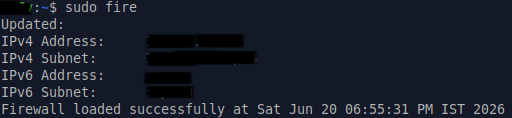
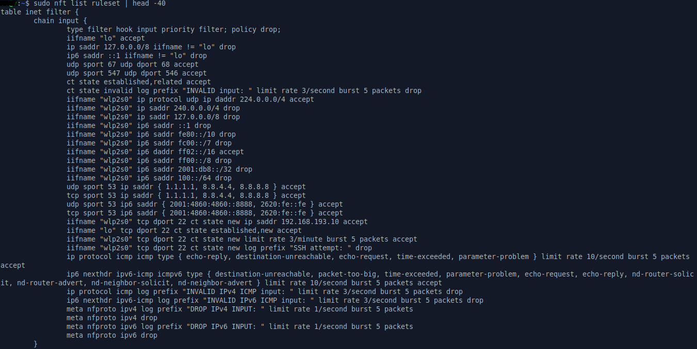
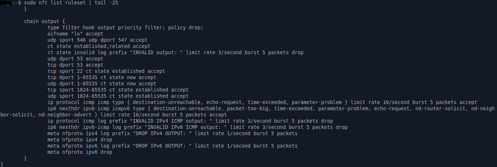
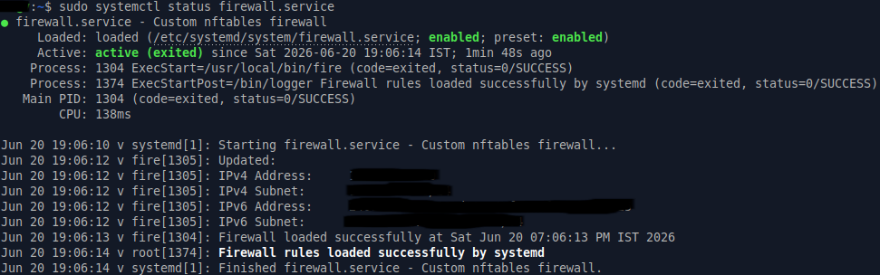

# Linux nftables Firewall

A modular, dynamic firewall built using nftables on Linux (Xubuntu), supporting both IPv4 and IPv6, with automated boot-time loading via systemd.

This project was built by studying *Linux Firewalls: Enhancing Security with nftables and Beyond* by Steve Suehring (4th Edition), then extending the concepts through hands-on testing, debugging, and real-world deployment on a personal laptop.

---

## Features

- Modular policy-based design (one file per security concern)
- Full IPv4 and IPv6 support throughout
- Dynamic IP address detection at runtime (handles changing ISP-assigned IPs)
- Stateful connection tracking (established, related, invalid states)
- Rate-limited ICMP and ICMPv6 handling (flood protection)
- SSH access restricted to a trusted host with brute-force rate limiting
- DNS traffic restricted to known resolvers (prevents spoofing)
- Anti-spoofing protection for loopback and bogon address ranges
- Comprehensive logging for dropped/invalid packets
- DHCP and DHCPv6 aware (handled before connection state rules)
- Automated loading at boot via systemd service
- Default-deny policy on both input and output chains

---

## System Requirements

- Linux distribution with nftables support (tested on Xubuntu)
- nftables installed (`sudo apt install nftables`)
- systemd (for automated boot loading)
- Root/sudo privileges

---

## Repository Structure

```
linux-nftables-firewall/
│
├── firewall/
│   ├── fire.sh                      # Main loader script
│   ├── updateIP.sh                  # Dynamic IP detection script
│   ├── nft-vars.nft                 # Variable definitions
│   ├── setup-tables.nft             # Table and chain setup
│   ├── localhost-policy.nft         # Loopback rules
│   ├── connectionstate-policy.nft   # Connection state + DHCP rules
│   ├── invalid-policy.nft           # Bogon/invalid address drops
│   ├── dns-policy.nft               # DNS allow rules
│   ├── ssh-policy.nft               # SSH access control
│   ├── tcpclient-policy.nft         # Outgoing connection rules
│   ├── icmp-policy.nft              # ICMP/ICMPv6 rules
│   └── log-policy.nft               # Final catch-all logging
│
├── systemd/
│   └── firewall.service             # systemd unit file
│
└── screenshots/
    ├── firewall-loaded.PNG
    ├── nft-list-ruleset-input.PNG
    ├── nft-list-ruleset-output.PNG
    └── systemd-status.PNG
```

---

## Screenshots

**Firewall Loaded**





**Input Chain Ruleset**





**Output Chain Ruleset**





**Systemd Status After Reboot**




---

## How It Works

The firewall follows a default-deny, explicit-allow security model:

1. `updateIP.sh` runs first, detecting the current IPv4 and IPv6 addresses and subnets, and writing them into `nft-vars.nft`
2. `fire.sh` combines all `.nft` policy files into a single temporary ruleset
3. The existing nftables ruleset is flushed
4. The combined ruleset is loaded in a single parser session (required for nftables variable references to resolve correctly across files)
5. Both `input` and `output` chains default to `policy drop` — only explicitly permitted traffic is allowed
6. Any traffic not matching an explicit rule is logged and dropped by `log-policy.nft`

---

## Installation and Setup

**1. Copy files to system locations:**

```bash
sudo mkdir -p /etc/firewall
sudo cp firewall/*.nft /etc/firewall/
sudo cp firewall/updateIP.sh /etc/firewall/
sudo cp firewall/fire.sh /usr/local/bin/fire
sudo chmod +x /usr/local/bin/fire
sudo chmod +x /etc/firewall/updateIP.sh
```

**2. Edit the network interface name:**

Open `updateIP.sh` and `nft-vars.nft`, and change `wlp2s0` to match your own interface name.

Find your interface name with:
```bash
ip link show
```

**3. Edit the trusted SSH host IP:**

Open `ssh-policy.nft` and change `192.168.193.10` to your own trusted host IP address.

**4. Test the firewall manually:**

```bash
sudo fire
sudo nft list ruleset
```

**5. Install the systemd service:**

```bash
sudo cp systemd/firewall.service /etc/systemd/system/
sudo systemctl daemon-reload
sudo systemctl start firewall.service
sudo systemctl status firewall.service
```

**6. Enable automatic loading at boot:**

```bash
sudo systemctl enable firewall.service
```

---

## File Descriptions

| File | Purpose |
|------|---------|
| `fire.sh` | Combines all policy files and loads them into nftables in one session |
| `updateIP.sh` | Detects current IPv4/IPv6 address and subnet, updates `nft-vars.nft` |
| `nft-vars.nft` | Defines reusable variables (interfaces, IP ranges, ports) |
| `setup-tables.nft` | Defines the base table and chains with default-drop policy |
| `localhost-policy.nft` | Allows loopback traffic, blocks loopback spoofing |
| `connectionstate-policy.nft` | Handles DHCP/DHCPv6 and connection state tracking |
| `invalid-policy.nft` | Drops bogon addresses and invalid source ranges on external interface |
| `dns-policy.nft` | Allows DNS queries/replies restricted to known resolvers |
| `ssh-policy.nft` | Restricts SSH to a trusted host with rate limiting |
| `tcpclient-policy.nft` | Allows outgoing TCP/UDP client connections |
| `icmp-policy.nft` | Allows rate-limited ICMP/ICMPv6 with full type filtering |
| `log-policy.nft` | Logs and drops any unmatched traffic |

---

## Boot Ordering Decision

The systemd service uses:

```ini
After=network-online.target
Wants=network-online.target
```

This was a deliberate change from the initially planned `network-pre.target` approach, made after testing revealed a real issue.

**The problem:** `updateIP.sh` dynamically detects the current IPv4 and IPv6 addresses at runtime. When the firewall loaded before the network interface was fully up (using `network-pre.target`), IP detection failed, resulting in empty variable definitions in `nft-vars.nft` and a broken ruleset.

**The fix:** Switching to `After=network-online.target` ensures the network interface is fully initialized and has received its IP address before the firewall loads, allowing correct dynamic IP detection every time.

For a server environment where eliminating any unprotected network window is the priority, a different ordering would be required. For this personal laptop use case, correct IP detection takes priority, and this ordering was verified to work correctly across multiple reboots.

---

## Verified Boot Output

After enabling the service and rebooting, the firewall loads automatically:


`Type=oneshot` combined with `RemainAfterExit=yes` is used because the firewall script loads rules once and exits, rather than running as a continuous daemon. Without `RemainAfterExit=yes`, systemd would mark the service as inactive immediately after the script completes.

---

## Security Design Decisions

**Default-deny on both chains:** Both `input` and `output` chains use `policy drop`. Only traffic matching an explicit rule is permitted. Anything else is logged and dropped, providing visibility into unexpected traffic that might indicate misconfiguration or compromise.

**DHCP handled before connection state:** DHCP reply packets are accepted before the `ct state established,related` rule, since DHCP packets arrive before any connection state exists.

**DNS restricted to known resolvers:** Rather than accepting DNS replies from any source port 53, DNS is restricted to specific trusted resolvers (Google, Cloudflare) to reduce the risk of DNS response spoofing.

**SSH rate limiting:** SSH connection attempts are limited to 3 per minute with logging of attempts, providing basic brute-force protection alongside source IP restriction.

**ICMP rate limiting:** All ICMP and ICMPv6 traffic is rate-limited to prevent ICMP flood-based denial of service, while still allowing necessary diagnostic and IPv6 Neighbor Discovery Protocol traffic.

**IPv6 fully considered:** Rather than treating IPv6 as an afterthought, every policy file includes corresponding IPv6 rules, including proper handling of Neighbor Discovery Protocol (NDP) types required for IPv6 to function correctly.

---

## Note on Interface and Host Configuration

This firewall was built and tested for a specific personal laptop environment. Before use on another system:

- Change the interface name (`wlp2s0`) in `updateIP.sh` and `nft-vars.nft` to match your system
- Change the trusted SSH source IP in `ssh-policy.nft` to your own trusted host
- Review `tcpclient-policy.nft` — current rules permit all outgoing TCP/UDP connections, suitable for a personal workstation but not recommended as-is for a server deployment

---

## Known Limitations

- `tcpclient-policy.nft` allows all outgoing ports (1-65535), which is appropriate for general workstation use but would need restriction for server use cases
- Forward chain is present but commented out in `setup-tables.nft`, as this firewall is designed for a single host, not a routing device

---

## Future Improvements

- Add stricter outbound rules suitable for server deployments
- Integrate logging with journalctl or external log analysis tools for easier monitoring
- Explore enabling NAT/gateway mode for lab or homelab environments
- Package the scripts into a Debian/Ubuntu `.deb` for easier installation and distribution

---

## Reference

*Linux Firewalls: Enhancing Security with nftables and Beyond*, 4th Edition — Steve Suehring
